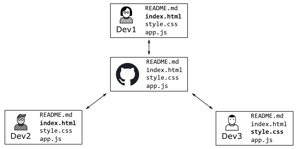
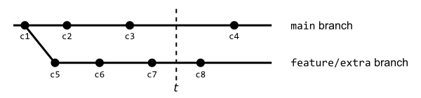
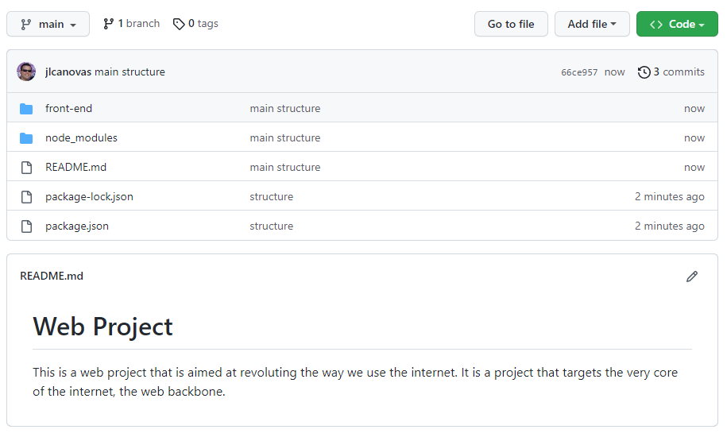

# PJP PAC 1

En aquesta PAC aprendrem a gestionar Github i el seu entorn de programació estandard que utilitzarem a la resta de PACs de l'assignatura.

## Competències
En aquesta PAC es desenvolupen les següents competències del Màster:

- Utilitzar de manera adequada el llenguatge JavaScript i fer-lo servir en el desenvolupament de llocs i aplicacions web, en funció de les necessitats del projecte.
- Adaptar-se a les tecnologies web i als entorns futurs, actualitzant les competències professionals.
- Aprendre i actualitzar-se permanentme

## Objectius

Els objectius d'aquesta PAC són:

- Configurar un entorn de treball per desenvolupar aplicacions en JavaScript.
- Conèixer i saber utilitzar les ordres bàsiques de Git.
- Conéixer i saber utilitzar GitHub i les principals tasques col·laboratives de la plataforma.
- Revisar el nivell previ de programació.
- Posar en pràctica coneixements bàsics de JavaScript.

## Entrega de la PAC

Un cop hagis realitzat les activitats pràctiques proposades en aquest enunciat, **el lliurament es realitzarà de forma doble**:

- Hauràs d'enviar els teus canvis al Registre d'Avaluació Contínua (RAC) del campus virtual de la UOC.
- Hauràs d'enviar els teus canvis al Repositori de GitHub Classroom.

Recorda que aquest repositori l'has clonat del repositori a GitHub. Quan treballis al teu sistema, tots els canvis els faràs als teus fitxers locals, els quals hauràs d'afegir i _comitejar_ al teu repositori Git. Aquests canvis estaran al teu sistema fins que facis _push_ i els enviïs al repositori a GitHub. 

Recorda que has de treballar a la branca _main_ o _master_ (la que es crei per defecte). Pots fer diversos enviaments.

A l'aula virtual trobaras una _checklist_ que t'ajudarà a repassar tots els passos que has de fer per al lliurament de la teva PAC.

## Puntuació

El fet de treballar amb tests per verificar la funcionalitat del codi, us permetrà tenir una idea de la vostra pròpia nota abans del lliurament. 

La puntuació dels exercicis pràctics es basa en dos criteris: **Funcionalitat** i **implementació**. S'espera que els exercicis funcionin correctament (passin els tests) i que la implementació (el codi) tingui una qualitat adequada. 

Alguns detalls a tenir en compte:

- Es penalitzarà qualsevol intent de _hardcodejar_ els tests per forçar que passin. Aquesta tècnica consisteix a canviar la implementació perquè torni únicament el valor esperat pel test (qualsevol altre test fallaria).
- Els tests automàtics estan dissenyats per detectar exercicis erronis o incomplets. El fet que un test passi no garanteix que lexercici estigui realitzat correctament.
- Un exercici els tests del qual no passen es puntuarà amb un 0 llevat que hi hagi problemes amb el test.
- A més de passar els tests, el professorat avaluarà el vostre codi en base als criteris següents:
  - Llegibilitat, senzillesa i qualitat del codi.
  - Coneixements de programació. Per exemple, no utilitzar les estructures de control adequades, com ara utilitzar un bucle per construir una sentència condicional o viceversa.

## Requeriments mínims

- Tenir instal·lat Visual Studio Code.
- Coneixements bàsics de Git i GitHub (Activitats 2 i 3 del Repte 1).
- Coneixements bàsics de programació (Requisit de l'assignatura).

## Preguntes Teòriques (8p)

Hauràs de respondre aquestes preguntes al fitxer del repositori: `src/pec1/pec1.md`.

#### Exercici T1 (3p)

La següent imatge mostra un escenari de desenvolupament col·laboratiu a GitHub:



El repositori a GitHub té els fitxers indicats a la imatge (part central), que cada desenvolupador té al seu ordinador després d'haver-lo clonat (cadascuna de les caixes representa un desenvolupador). A més, cada desenvolupador ha editat el fitxer indicat en negreta.

Respon i raona les preguntes següents (màxim 300 paraules):
* (2p) Indica les ordres que hauria de realitzar cada desenvolupador per sincronitzar els seus canvis amb el repositori al GitHub.
* (1p) Es pot donar alguna situació de conflicte en aquest escenari?

#### Exercici T2 (3p)

La figura següent mostra l'estat d'un repositori amb branques:



Un desenvolupador està treballant a la branca `feature/extra`. A l'instant _t_ els seus companys li notifiquen que ha d'alinear la branca amb la principal.

Respon i raona la pregunta següent (màxim 300 paraules):
* (1p) Quins commits estan considerats a la branca `feature/extra`? Quins commits estan considerats a la branca `main`?
* (2p) Descriu amb les teves pròpies paraules què hauria de fer el desenvolupador per fer la tasca que li han demanat. Heu d'indicar les ordres que heu d'executar i l'estat de la branca `feature/extra` després de realitzar la tasca.

#### Exercici T3 (1p)

La captura de pantalla següent mostra un repositori d'un projecte web:



Respon i raona les preguntes següents (màxim 300 paraules):
* (0.5p) Aquest repositori té un problema, quin és? què haurien d'haver fet els desenvolupadors per evitar-ho?
* (0.5p) Quines altres comprovacions s'haurien de tenir en compte abans d'enviar el codi a GitHub?

> Nota: En aquest exercici no es demana que corregeixis el problema, sinó que l'identifiquis i que indiquis què haurien d'haver fet els desenvolupadors per evitar-ho.

#### Exercici T4. (1p)

Imagina que trobes un repositori a GitHub on vols contribuir.

Respon i raona la pregunta següent (màxim 300 paraules)
* Descriu els passos que seguiries per fer una aportació basada en el desenvolupament basat en _pull requests_.

## Exercicis pràctics (2p)

Per realitzar els exercicis pràctics t'has de dirigir a la següent ruta dins del repositori: `src/pec1/pec1.js`.
En aquest fitxer hauràs de definir les funcions que t'indiquem als exercicis que veuràs més avall.

D'altra banda, els tests que et permetran saber si la solució que proposes per als exercicis és correcta són al fitxer `src/pec/pec1.spec.js`.
**No has d'editar aquest fitxer**.
Tingues en compte que els tests són condicions que han de complir les funcions que implementaràs en els exercicis, per la qual cosa et poden servir d'ajuda per corregir-los.

### Preparant l'entorn. (0p)

En primer lloc, assegura't que tens instal·lats:

- [Node.js](https://nodejs.org/es/)
- [VSCode](https://code.visualstudio.com/)
- [Git](https://git-scm.com/)

Perquè el vostre professor us localitzi a GitHub Classroom, recorda que necessita conèixer el vostre _login_ a la plataforma. Un cop estigueu registrats a GitHub, podeu informar del vostre _login_ tal com es descriu a l'activitat 4.2 del Repte 1.

A continuació us donem algunes indicacions per preparar el vostre repositori per a la realització dels exercicis.

#### Instal·la les dependències del projecte

````
npm install
````

#### Executa els tests

````
npm t
````

La instrucció anterior llançarà els tests cada vegada que deseu el fitxer `src/pec1/pec1.js`, que és precisament on implementareu els exercicis d'aquesta PAC.

Com pots esperar, la primera vegada que executis `npm t` i es llencin els tests, fallaran tots, ja que no hi ha cap exercici implementat. Revisa el missatge d'error que s'imprimeix per conèixer el format i entendre com es notifiquen els errors.

Aquest és un exemple d'una possible sortida d'error:

````
  FAIL src/pec1/pec1.spec.js
   ex1:
     × should return true when temp is bigger or equal than 37.0 (2 ms)
````

És important fixar-se en la descripció de l'error, per exemple, el text d'error anterior indica que per a l'exercici 1 (`ex1`) la funció ha de tornar `true` si `temp` és més gran o igual que 37.0. Aquesta indicació us ajuda a revisar el codi per comprovar perquè el comportament no és l'esperat.

Un cop corregit el problema, quan es desa el fitxer on estem editant els exercicis, el test es torna a llançar i ens mostraria:

````
  PASS src/pec1/pec1.spec.js
   ex1
     √ should return true when temp is bigger or equal than 37.0 (2 ms)
````

Ara el test mostra `PASS` i el cas de prova que abans fallava es mostra com a correcte (amb el caràcter `√`).

L'entorn de proves té un menú (accessible mitjançant la tecla `w`) que us permet executar els tests selectivament. Per exemple, prement `a` podeu rellançar manualment tots els tests; i prement `f` podeu rellançar només aquells tests que han fallat. Proveu les diferents opcions i si teniu algun dubte, consulteu-lo al fòrum de l'assignatura.

### Exercici 1 (1p)

Implementar una funció `ex1` que determina si una determinada temperatura pot ser representativa per a un estat febril d'una persona.

La funció rebrà el paràmetre següent:
* `temp`: Serà la temperatura mesurada d'una persona. És un valor numèric positiu que pot portar decimals.

La funció tornarà `true` si la temperatura és superior o igual a 37 graus i `false` en un altre cas.


### Exercici 2 (1p)

Implementar una funció `ex2` que calculi el preu de venda al públic (PVP) per a un determinat producte.

La funció rebrà els paràmetres següents:
* `price`: El preu de venda recomanat. És un preu que té en compte el procés i els costos de producció però que no considera els impostos. És un valor numèric positiu que pot portar decimals.
* `tax`: És l'impost a aplicar, normalment anomenat l'impost al valor agregat (IVA). És un valor numèric positiu que pot portar decimals.

La funció haurà de tornar el preu de venda al públic, que es calcularà afegint al preu de venda recomanat l'impost a aplicar.