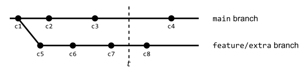

# PJP PEC 1

En esta PEC vamos a aprender a manejar Github y el entorno de programación estándar que utilizaremos en el resto de PECs de la asignatura.

## Competencias

En esta PEC se desarrollan las siguientes competencias del Máster:

- Utilizar de manera adecuada el lenguaje JavaScript y usarlo en el desarrollo de sitios y aplicaciones web, en función de las necesidades del proyecto.
- Adaptarse a las tecnologías web y a los futuros entornos, actualizando las competencias profesionales.
- Aprender y actualizarse permanentemente. 

## Objetivos

Los objetivos de esta PEC son:

- Configurar un entorno de trabajo para el desarrollo de aplicaciones en JavaScript.
- Conocer y saber utilizar los comandos básicos de Git.
- Conocer y saber utilizar GitHub y las principales tareas colaborativas de la plataforma.
- Revisar el nivel previo de programación.
- Poner en práctica conocimientos básicos de JavaScript.

## Entrega de la PEC

Una vez hayas realizado las actividades prácticas propuestas en este enunciado, **la entrega se realizará de forma doble**:

- Deberás enviar tus cambios al Registro de Evaluación Continua (REC) del campus virtual de la UOC.
- Deberás enviar tus cambios al repositorio de GitHub Classroom.

Recuerda que este repositorio lo has clonado del repositorio en GitHub. Cuando trabajes en tu sistema, todos los cambios los harás en tus ficheros locales, los cuales tendrás que añadir y _comitear_ a tu repositorio Git. Estos cambios estarán en tu sistema hasta que hagas _push_ y los envíes al repositorio en GitHub.

Recuerda que debes trabajar en la rama _main_ o _master_ (la que se cree por defecto). Puedes hacer varios envíos.

En el aula virtual encontrarás una _checklist_ que te ayudará a repasar todos los pasos que debes hacer para la entrega de tu PEC.

## Puntuación

El hecho de trabajar con tests para verificar la funcionalidad del código os permitirá tener una idea de vuestra propia nota antes de la entrega. 

La puntuación de los ejercicios prácticos se basa en dos criterios: **Funcionalidad** e **implementación**. Se espera que los ejercicios funcionen correctamente (pasen los tests) y que la implementación (el código) tenga una calidad adecuada. 

Algunos detalles a tener en cuenta:

- Se penalizará cualquier intento de _hardcodear_ los tests para forzar que pasen. Esta técnica consiste en cambiar la implementación para que devuelva únicamente el valor esperado por el test (cualquier otro test fallaría).
- Los tests automáticos están diseñados para detectar ejercicios erróneos o incompletos para casos concretos. El hecho de que un test pase no garantiza que el ejercicio esté realizado correctamente, es decir, que cubra todos los casos.
- Un ejercicio cuyos tests no pasan se puntuará con un 0 salvo que existan problemas con el test.
- Además de pasar los tests, el profesorado evaluará vuestro código en base a los siguientes criterios:
  - Legibilidad, sencillez y calidad del código.
  - Conocimientos de programación. Por ejemplo, no utilizar las estructuras de control adecuadas, como utilizar un bucle para construir una sentencia condicional o viceversa.

## Requisitos mínimos

- Tener instalado Visual Studio Code.
- Conocimientos básicos de Git y GitHub (Actividades 2 y 3 del Reto 1).
- Conocimientos básicos de programación (Requisito de la asignatura).

## Preguntas Teóricas (8p)

Deberás responder a estas preguntas en el fichero del repositorio: `src/pec1/pec1.md`.

#### Ejercicio T1 (3p)

La siguiente imagen muestra un escenario de desarrollo colaborativo en GitHub:


El repositorio en GitHub tiene los ficheros indicados en la imagen (parte central), que cada desarrollador tiene en su ordenador después de haberlo clonado (cada una de las cajas representa a un desarrollador). Además, cada desarrollador ha editado el fichero indicado en negrita.

Responde y razona las siguientes preguntas (máximo 300 palabras):
* (2p) Indica los comandos que debería realizar cada desarrollador para sincronizar sus cambios con el repositorio en GitHub.
* (1p) ¿Puede darse alguna situación de conflicto en este escenario?

#### Ejercicio T2 (3p)

La siguiente figura muestra el estado de un repositorio con ramas:



Un desarrollador está trabajando en la rama `feature/extra`. En el instante _t_ sus compañeros le notifican que debe alinear su rama con la principal. 

Responde y razona la siguiente pregunta (máximo 300 palabras):
* (1p) ¿Qué commits están considerados en la rama `feature/extra`? ¿Qué commits están considerados en la rama `main`? 
* (2p) Describe con tus propias palabras qué debería hacer el desarrollador para realizar la tarea que le han pedido. Debes indicar los comandos que debería ejecutar y el estado de la rama `feature/extra` después de realizar la tarea.

#### Ejercicio T3 (1p)

La siguiente captura de pantalla muestra un repositorio de un proyecto web:


Responde y razona las siguientes preguntas (máximo 300 palabras):
* (0.5p) Este repositorio tiene un problema, ¿cuál es? ¿qué deberían haber hecho los desarrolladores para evitarlo?
* (0.5p) ¿Qué otras comprobaciones deberían tenerse en cuenta antes de enviar el código a GitHub?

> Nota: En este ejercicio no se pide que corrijas el problema, sino que lo identifiques y que indiques qué deberían haber hecho los desarrolladores para evitarlo.

#### Ejercicio T4. (1p)

Imagina que encuentras un repositorio en GitHub al que quieres contribuir. 

Responde y razona la siguiente pregunta (máximo 300 palabras)
* Describe los pasos que seguirías para hacer una aportación basada en el desarrollo basado en _pull requests_.


## Ejercicios prácticos (2p)

Para realizar los ejercicios prácticos debes dirigirte a la siguiente ruta dentro del repositorio: `src/pec1/pec1.js`.
En este fichero deberás definir las funciones que te indicamos en los ejercicios que verás más abajo.

Por otro lado, los tests que te permitirán saber si la solución que propones para los ejercicios es correcta están en el fichero `src/pec/pec1.spec.js`.
**No debes editar este fichero**.
Ten en cuenta que los tests son condiciones que deben cumplir las funciones que implementarás en los ejercicios, por lo que pueden servirte de ayuda para corregirlos.

### Preparando el entorno. (0p)

En primer lugar, asegúrate de que tienes instalados:

- [Node.js](https://nodejs.org/es/)
- [VSCode](https://code.visualstudio.com/)
- [Git](https://git-scm.com/)

Para que vuestro profesor os localice en GitHub Classroom, recuerda que necesita conocer vuestro _login_ en la plataforma. Una vez estéis registrados en GitHub, podéis informar de vuestro _login_ tal y como se describe en la actividad 4.2 del Reto 1. 

A continuación te damos algunas indicaciones para preparar tu repositorio para la realización de los ejercicios.

#### Instala las dependencias del proyecto

```
npm install
```

#### Ejecuta los tests

```
npm t
```

La instrucción anterior lanzará los tests cada vez que guardes el fichero `src/pec1/pec1.js`, que es precisamente donde implementarás los ejercicios de esta PEC.

Como puedes esperar, la primera vez que ejecutes `npm t` y se lancen los tests, fallarán todos, ya que no hay ningún ejercicio implementado. Revisa el mensaje de error que se imprime para conocer su formato y entender cómo se notifican los errores.

Este es un ejemplo de una posible salida de error:

```
 FAIL  src/pec1/pec1.spec.js
  ex1:
    × should return true when temp is bigger or equal than 37.0 (2 ms)
```

Es importante fijarse en la descripción del error, por ejemplo, el texto de error anterior indica que para el ejercicio 1 (`ex1`) la función debe devolver `true` si `temp` es mayor o igual que 37.0. Esta indicación os ayuda a revisar el código para comprobar porqué el comportamiento no es el esperado.

Una vez corregido el problema, en cuanto se guarda el fichero donde estamos editando los ejercicios, el test se vuelve a lanzar y nos mostraría:

```
 PASS  src/pec1/pec1.spec.js
  ex1
    √ should return true when temp is bigger or equal than 37.0 (2 ms)
```

Ahora el test muestra `PASS` y el caso de prueba que antes fallaba se muestra como correcto (con el carácter `√`).

El entorno de pruebas tiene un menú (accesible mediante la tecla `w`) que os permite ejecutar los tests selectivamente. Por ejemplo, pulsando `a` podéis relanzar manualmente todos los tests; y pulsando `f` podéis relanzar solamente aquellos tests que han fallado. Probad las diferentes opciones y si tenéis alguna duda, consultadla en el foro de la asignatura.

### Ejercicio 1 (1p)

Implementar una función `ex1` que determina si una determinada temperatura puede ser representativa para un estado febril de una persona.

La función recibirá el siguiente parámetro:
* `temp`: Será la temperatura medida de una persona. Es un valor numérico positivo que puede llevar decimales.

La función devolverá `true` si la temperatura es superior o igual a 37 grados y `false` en otro caso.


### Ejercicio 2 (1p)

Implementar una función `ex2` que calcule el precio de venta al público (PVP) para un determinado producto.

La función recibirá los siguiente parámetros:
* `price`: El precio de venta recomendado. Es un precio que tiene en cuenta el proceso y los costos de producción, pero que no considera los impuestos. Es un valor numérico positivo que puede llevar decimales.
* `tax`: Es el impuesto a aplicar, normalmente llamado el impuesto al valor agregado (IVA). Es un valor numérico positivo que puede llevar decimales.

La función deberá devolver el precio de venta al público, que se calculará añadiendo al precio de venta recomendado el impuesto a aplicar. 
